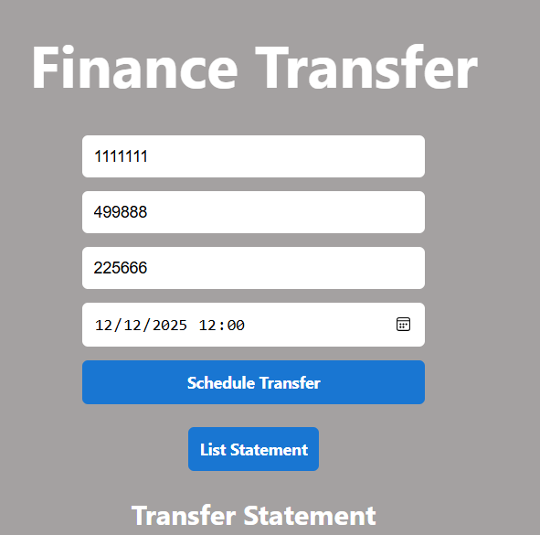
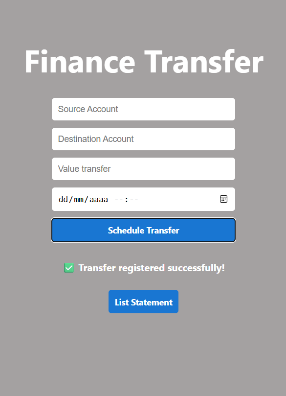
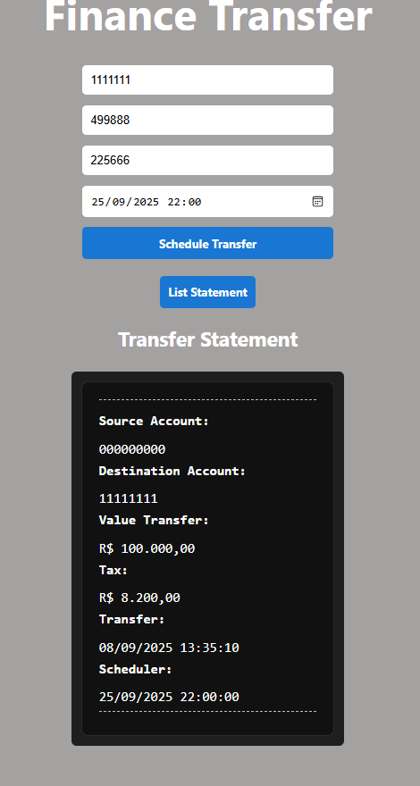
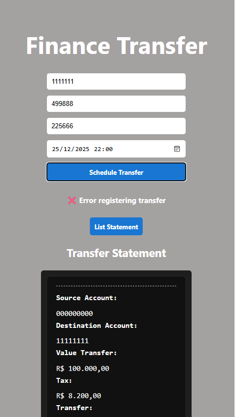

## Transfer Scheduling App

Minimal guide to build and run locally. The packaged JAR serves both the REST API and the built SPA.

**Stack**
- Backend: Spring Boot 2.7 (Java 11), Spring Web, JPA, H2 (in-memory)
- Frontend: Vue 3 + Vite (built by Maven and copied to backend `/static`)

**Requirements**
- JDK 11+ installed (Maven Wrapper included)

**Quick Start**
- Clone: `git@github.com:JosePaulo2301/transfer-scheduling-app.git`
- Build:
  - Linux/macOS: `cd backend && ./mvnw clean package -DskipTests`
  - Windows (PowerShell): `cd backend; .\mvnw.cmd clean package -DskipTests`
- Run: `java -jar target/app-0.0.1-SNAPSHOT.jar`
- Access: `http://localhost:8080` (SPA served at `/`)

**Main API**
- POST `/api/v1/scheduler` — create a scheduled transfer
- GET `/api/v1/extract` — list scheduled transfers

## Transfer Scheduling App

**INTERFACE**

**FILLING**

**MAKING APPOINTMENT**

**RESCUING APPOINTMENT via LIST DECLARATION**

**SIMILATING ERROR WITH A DATE OUTSIDE THE RULE**

## 
- **DEV Name: jose.dev2301@gmail.com**
- **Test Requesting Company: Tokio Marine**